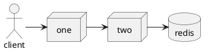

[PlantUML](https://blog.anoff.io/2018-07-31-diagrams-with-plantuml)

# Dependencies

1. Api One
2. Api Two
3. Redis

## Running locally

1. Clone the repo and cd into the directory
2. ` dotnet tool install -g Microsoft.Tye --version "0.6.0-alpha.21070.5"`
3. `tye run`
4. open dashboard at `http://localhost:8000/`

### Debugging

> Debugging pauses execution of our hosted projects until a debugger is attached. 

`tye run --debug api-two`

`tye run --debug *`

Then in IDE - attach to the running process for `api-two`

> To Hot reload on changes

`tye run --watch`

## Documentation

https://khalidabuhakmeh.com/local-dev-with-tye-docker-and-dotnet

